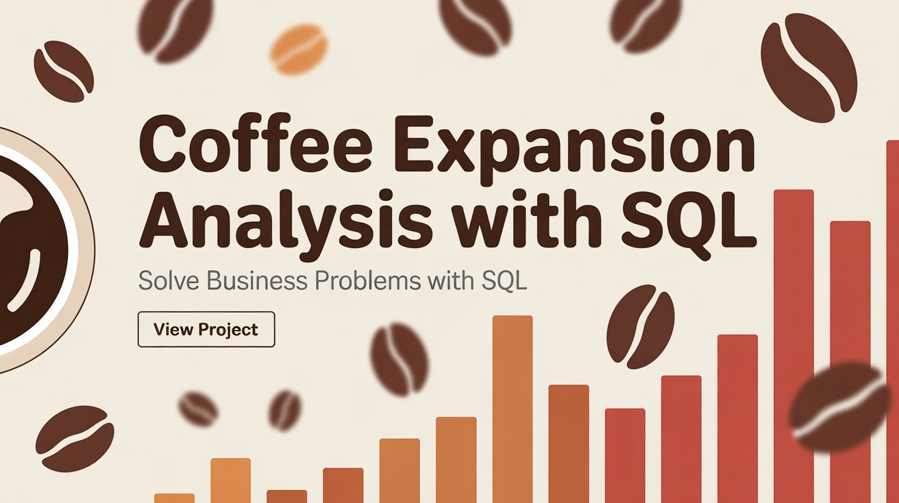

Analyze coffee sales across different Indian cities using SQL...
#  Coffee Expansion Analysis with SQL

Analyze coffee sales across different Indian cities using SQL. This project includes real business questions and powerful insights from structured data.

---

##  Key Insights Answered

-  How many people are estimated to consume coffee in each city?
-  Which cities generate the highest coffee revenue?
-  What are the top-selling coffee products by city?
-  How is monthly sales growth trending?
-  How do average sales and rent compare per customer?
-  Which cities have the strongest market potential?

---

##  SQL Concepts Used

- `JOIN` operations (INNER, LEFT)
- `GROUP BY` and `COUNT(DISTINCT)`
- `CTEs` and subqueries
- `DENSE_RANK()` for product ranking
- `LAG()` and `ROUND()` for growth % and metrics

---

##  File Included

- `Queries.sql` – contains 10+ structured SQL questions and answers

---

##  Author

**Priyanshu Barjatia**  
Aspiring Data Analyst | SQL Enthusiast | Self-Taught Learner
